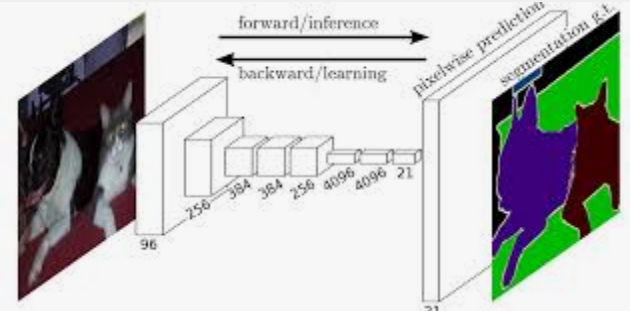
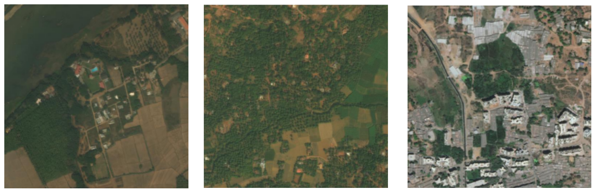
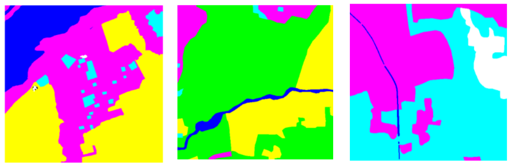
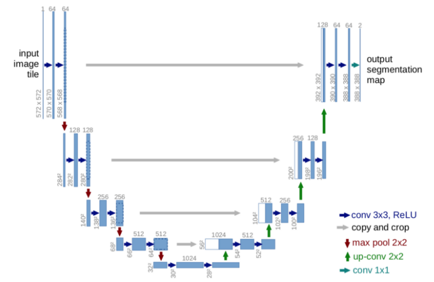
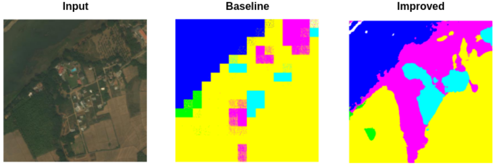

# trytry-segmentation

Semantic segmentation is about predicting the class of image at pixel level. Not only know what are in the image, but also where they are y in pixel level.


## Fetch dataset
Using following sript to get satellite dataset
```bash
$ ./scripts/get_dataset.sh
```
- Raw images


- Mask images


## Train model
```bash
$ python3 main.py --config config/segmentation_unet.yml
```
The segmentation model architecture is an invariant of UNet. The encoder (left) part of the model is the vgg16 feature extraction layer pretrained on imagenet.


## Tensorboard
```bash
$ tensorboard --logdir run --host 0.0.0.0
```
Here is the training result


## Training tips
- The loss function of segmentation is simply crossentropy loss with 2D dimension (Pytorch provides this 2D crossentropy)
- By combining finer(local) features and coarse(global) features together, the model can reconstruct a more detailed mask image
- When coding your custom torch dataset, be aware of the dimension of training image and training mask. ( Dim =? (h, w, c), or Dim =? (w, h, c) )
